# Twit Web application

Веб-приложение Twit - это клон социальных сетей, приложение crud, в котором пользователи создают учетные записи и публикуют, редактируют посты, добавляют изображения к постам и комментарии.
Пользователь может зарегистрироваться на веб-сайте, и он увидит все сообщения от других пользователей, и он может сделать Post (Twit).
он может просмотреть свой пост, отредактировать его или удалить. а также он может прокомментировать любой Post.Пользователь также может видеть комментарии к своему посту, которые пришли от других пользователей,
и он может ответить на этот комментарий. 


<details>
 <summary><h2>Содержимое для использования</h2></summary>

- Laravel v10
- Docker
- Node.js & NPM
- Reactjs
- Inertiajs
- MySQL 
- Elasticsearch для получения логов из приложения
- Kibana для просмотра логов, которые находятся в elasticsearch и поступают из приложения
- Grafana для просмотра логов также из elasticsearch

</details>

# использование
1. Php 8
2. Laravel 10
3. ReactJs
4. Mysql
5. Docker & docker compose
6. Prometheus Custom metrics
7. Prometheus Alertmanager
8. Node exporter
9. Blackbox exporte
10. Mysql exporter
11. Nginx

<details>
 <summary><h2>Шаги, которые я сделал для этого проекта</h2></summary>


1. Создайте файл docker-compose с изображениями (app, mysql, elasticsearch, kibana, grafana):

Представляет файл docker-compose.yml, который определяет конфигурацию сервисов и их зависимостей в Docker-контейнерах.
version: '3.8': Определяет версию синтаксиса для файла docker-compose.yml (версия 3.8).

services: Определяет список сервисов, которые будут запущены в контейнерах.

app: Описывает сервис приложения Laravel.

build: Указывает, что контейнер будет построен на основе Docker-образа, используя Dockerfile из текущего контекста.
container_name: Задает имя контейнера (laravel_app).
ports: Открывает порт хоста 8000 и перенаправляет его на порт контейнера 8000.
volumes: Монтирует текущую директорию внутрь контейнера в директорию /var/www/html.
depends_on: Задает зависимость от сервиса "mysql".
mysql: Описывает сервис базы данных MySQL.

image: Указывает Docker-образ, который будет использован (mysql:8.0).
ports: Открывает порт хоста 3307 и перенаправляет его на порт контейнера 3306.
environment: Задает переменные окружения для конфигурации MySQL.
volumes: Создает Docker Volume для хранения данных MySQL.
elasticsearch: Описывает сервис Elasticsearch.

image: Указывает Docker-образ Elasticsearch (elasticsearch:7.6.2).
container_name: Задает имя контейнера (elasticsearch).
environment: Задает переменные окружения для конфигурации Elasticsearch.
ports: Открывает порт хоста 9200 и перенаправляет его на порт контейнера 9200.
deploy: Определяет конфигурацию развертывания сервиса Elasticsearch.
kibana: Описывает сервис Kibana.

image: Указывает Docker-образ Kibana (kibana:7.6.2).
container_name: Задает имя контейнера (kibana).
ports: Открывает порт хоста 5601 и перенаправляет его на порт контейнера 5601.
depends_on: Задает зависимость от сервиса "elasticsearch".
grafana: Описывает сервис Grafana.

image: Указывает Docker-образ Grafana (grafana/grafana).
container_name: Задает имя контейнера (grafana).
ports: Открывает порт хоста 8080 и перенаправляет его на порт контейнера 3000.
depends_on: Задает зависимость от сервиса "elasticsearch".
volumes: Определяет список Docker Volumes, которые будут использоваться контейнерами.

twit_mysql_data: Создает Docker Volume с именем "twit_mysql_data" для хранения данных MySQL.

```bash
version: '3.8'

services:
    app:
        build:
            context: .
            dockerfile: Dockerfile
        container_name: laravel_app
        ports:
            - "8000:8000"
        volumes:
            - .:/var/www/html
        depends_on:
            - mysql

    mysql:
        image: mysql:8.0
        ports:
            - '3307:3306'
        environment:
            MYSQL_ROOT_PASSWORD: '${DB_PASSWORD}'
            MYSQL_ROOT_HOST: "%"
            MYSQL_DATABASE: '${DB_DATABASE}'
            MYSQL_PASSWORD: '${DB_PASSWORD}'
        volumes:
            - twit_mysql_data:/var/lib/mysql

    elasticsearch:
        image: elasticsearch:7.6.2
        container_name: elasticsearch
        environment:
            - discovery.type=single-node
        ports:
            - "9200:9200"
        deploy:
            resources:
                limits:
                    memory: 4g

    kibana:
        image: kibana:7.6.2
        container_name: kibana
        ports:
            - "5601:5601"
        depends_on:
            - elasticsearch

    grafana:
        image: grafana/grafana
        container_name: grafana
        ports:
            - "8080:3000"
        depends_on:
            - elasticsearch

volumes:
    twit_mysql_data:

```

2. Создать Dockerfile:

FROM php:8.2.0-fpm: Определяет базовый образ с PHP версии 8.2.0 и модулем FPM.

WORKDIR /var/www/html: Устанавливает рабочую директорию внутри образа на /var/www/html.

RUN apt-get update && apt-get install -y: Обновляет списки пакетов и устанавливает системные зависимости.

&& docker-php-ext-install zip pdo_mysql pdo_pgsql: Устанавливает расширения PHP для работы с ZIP, MySQL и PostgreSQL.

RUN curl -sS https://getcomposer.org/installer | php -- --install-dir=/usr/local/bin --filename=composer: Устанавливает Composer, менеджер зависимостей для PHP.

COPY . .: Копирует содержимое текущей директории (где находится Dockerfile) в рабочую директорию внутри образа.

RUN composer install: Устанавливает зависимости приложения с помощью Composer.

CMD php artisan serve --host=0.0.0.0 --port=8000: Устанавливает команду по умолчанию для запуска PHP-сервера разработки с помощью интерфейса командной строки artisan в Laravel. Сервер настроен на прослушивание всех сетевых интерфейсов (--host=0.0.0.0) и порта 8000 (--port=8000).

```bash
FROM php:8.2.0-fpm

WORKDIR /var/www/html

# Install system dependencies
RUN apt-get update && apt-get install -y \
    libzip-dev \
    zip \
    libpq-dev \
    && docker-php-ext-install zip pdo_mysql pdo_pgsql

# Install Composer
RUN curl -sS https://getcomposer.org/installer | php -- --install-dir=/usr/local/bin --filename=composer

# Copy application files
COPY . .

# Install application dependencies
RUN composer install

CMD php artisan serve --host=0.0.0.0 --port=8000

```
3. Установите docker<br><br><br>
4. Настроить файл .env :

Elasticsearch:

ELASTICSEARCH_HOST=elasticsearch: Хост Elasticsearch, где elasticsearch указывает на имя хоста Elasticsearch.
ELASTICSEARCH_PORT=9200: Порт Elasticsearch, где 9200 указывает на номер порта для подключения к Elasticsearch.
ELASTICSEARCH_SCHEME=http: Протокол для подключения к Elasticsearch, где http указывает на использование протокола HTTP.
ELASTICSEARCH_USER=: Пользователь Elasticsearch (не указано).
ELASTICSEARCH_PASS=: Пароль для пользователя Elasticsearch (не указано).
MySQL:

DB_CONNECTION=mysql: Тип соединения с базой данных MySQL.
DB_HOST=mysql: Хост базы данных MySQL, где mysql указывает на имя хоста.
DB_PORT=3306: Порт базы данных MySQL, где 3306 указывает на номер порта для подключения к MySQL.
DB_DATABASE=chirper: Имя базы данных MySQL, где chirper указывает на имя базы данных.
DB_USERNAME=root: Имя пользователя для подключения к базе данных MySQL, где root указывает на имя пользователя.
DB_PASSWORD=mysecretpassword: Пароль пользователя для подключения к базе данных MySQL, где mysecretpassword указывает на пароль.

```bash
ELASTICSEARCH_HOST=elasticsearch
ELASTICSEARCH_PORT=9200
ELASTICSEARCH_SCHEME=http
ELASTICSEARCH_USER=
ELASTICSEARCH_PASS=


DB_CONNECTION=mysql
DB_HOST=mysql
DB_PORT=3306
DB_DATABASE=chirper
DB_USERNAME=root
DB_PASSWORD=mysecretpassword
```
5. Установите elasticsearch с помощью composer :

```bash
composer require elasticsearch/elasticsearch
```

6. Настройте каналы в config/logging.php :

Этот код представляет собой конфигурацию каналов логирования в Laravel. Вот краткое объяснение каждого блока:

'stack' канал:

'driver' => 'stack': Использует драйвер "stack" для объединения нескольких каналов логирования.
'channels' => ['single', 'elasticsearch']: Определяет список каналов, которые будут использоваться в стеке. В данном случае, используются каналы "single" и "elasticsearch".
'ignore_exceptions' => false: Указывает, что исключения не будут игнорироваться и будут логироваться.
'elasticsearch' канал:

'driver' => 'custom': Использует пользовательский драйвер "custom" для канала.
'via' => App\Logging\ElasticsearchLogger::class: Задает класс ElasticsearchLogger в приложении, который будет использоваться для записи логов в Elasticsearch.
'client' => Elasticsearch\ClientBuilder::fromConfig([...]): Конфигурация клиента Elasticsearch, который будет использоваться для отправки логов.
'index' => 'twit_logs': Имя индекса Elasticsearch, в который будут сохраняться логи. Вы можете настроить это имя по вашему усмотрению.
'level' => 'info': Устанавливает уровень логирования для канала (info - информационные сообщения и выше будут логироваться).


```bash
  'channels' => [
        'stack' => [
            'driver' => 'stack',
            'channels' => ['single', 'elasticsearch'],
            'ignore_exceptions' => false,
        ],
        'elasticsearch' => [
            'driver' => 'custom',
            'via' => App\Logging\ElasticsearchLogger::class,
            'client' => Elasticsearch\ClientBuilder::fromConfig([
                'hosts' => [
                    [
                        'host' => env('ELASTICSEARCH_HOST', 'localhost'),
                        'port' => env('ELASTICSEARCH_PORT', 9200),
                        'scheme' => env('ELASTICSEARCH_SCHEME', 'http'),
                        'user' => env('ELASTICSEARCH_USER', null),
                        'pass' => env('ELASTICSEARCH_PASS', null),
                    ],
                ],
            ]),
            'index' => 'twit_logs', // Customize the index name as per your preference
            'level' => 'info',
        ],
    ],
```

7. Создайте класс App\Logging\Elasticsearch Logger с этим содержимым :

Этот код представляет пользовательский класс ElasticsearchLogger, 
который расширяет AbstractProcessingHandler из пакета Monolog.private $elasticsearch и 
private $index: Приватные свойства класса, которые содержат объект клиента Elasticsearch 
и имя индекса для сохранения логов.

__construct(Client $elasticsearch, $index, $level = Logger::DEBUG, bool $bubble = true): 
Конструктор класса, который принимает объект клиента Elasticsearch, имя индекса, уровень логирования 
(по умолчанию DEBUG) и флаг bubble (по умолчанию true).

protected function write(array $record): void: Защищенный метод, который выполняет запись логов. 
Он вызывается при каждой записи лога.
DateTime и DateTimeZone: Создает объект DateTime с текущим временным штампом в формате UTC.
$formattedTimestamp: Форматирует временной штамп в нужном формате.
if ($record['level'] >= $this->level): Проверяет, достигает ли уровень лога минимального уровня,
чтобы быть записанным в Elasticsearch.
$this->elasticsearch->index([...]): Использует объект клиента Elasticsearch для 
индексации (сохранения) логов в Elasticsearch. Индекс, сообщение, уровень лога, контекст 
и отформатированный временной штамп передаются в теле индексации.

```bash
class ElasticsearchLogger extends AbstractProcessingHandler
{
    private $elasticsearch;
    private $index;

    public function __construct(Client $elasticsearch, $index, $level = Logger::DEBUG, bool $bubble = true)
    {
        parent::__construct($level, $bubble);
        $this->elasticsearch = $elasticsearch;
        $this->index = $index;
    }

    protected function write(array $record): void
    {
        // Create a DateTime object with the current timestamp
        $timestamp = new DateTime('now', new DateTimeZone('UTC'));

        // Format the timestamp in the desired format
        $formattedTimestamp = $timestamp->format('Y-m-d\TH:i:s.u\Z');

        if ($record['level'] >= $this->level) {
            $this->elasticsearch->index([
                'index' => $this->index,
                'body' => [
                    'message' => $record['message'],
                    'level' => $record['level_name'],
                    'context' => $record['context'],
//                    'timestamp' => $record['datetime']->format('Y-m-d H:i:s'),
                    'timestamp' => $formattedTimestamp,
                ],
            ]);
        }
    }
}
```

8. Отправка логики при регистрации пользователя в elasticsearch :

Я использовал некоторые журналы в классе RegisterController.
когда пользователь зарегистрируется, журналы будут отправлены в elasticsearch с
сообщением о том, что зарегистрирован новый пользователь.<br><br><br><br>

$request->validate([...]): Выполняет проверку входящих данных из запроса на соответствие определенным правилам валидации.

'name' => 'required|string|max:255': Поле "name" обязательно для заполнения, должно быть строкой и иметь максимальную длину 255 символов.
'email' => 'required|string|email|max:255|unique:'.User::class: Поле "email" обязательно для заполнения, должно быть строкой, должно быть валидным email-адресом, иметь максимальную длину 255 символов и быть уникальным в таблице "users".
'password' => ['required', 'confirmed', Rules\Password::defaults()]: Поле "password" обязательно для заполнения, должно быть подтверждено с помощью дополнительного поле "password_confirmation" и должно соответствовать правилам, определенным в классе Rules\Password::defaults().
$user = User::create([...]): Создает новую запись пользователя в базе данных, используя метод create модели User. Используются значения из запроса для полей "name", "email" и "password". Пароль хешируется с помощью Hash::make().

event(new Registered($user)): Генерирует событие Registered, которое может быть обработано другими слушателями (listeners). Это позволяет выполнять дополнительные действия при регистрации нового пользователя.

Auth::login($user): Выполняет вход пользователя в систему, автоматически аутентифицируя его.

LogsController::sendLogs([...]): Вызывает статический метод sendLogs в LogsController для отправки логов. Передает сообщение "New user has registered", уровень лога "info" и данные о зарегистрированном пользователе (имя и электронная почта).

return redirect(RouteServiceProvider::HOME): Возвращает перенаправление на определенный маршрут, указанный в RouteServiceProvider::HOME (обычно это домашняя страница после успешной регистрации пользователя).

```bash

 public function store(Request $request): RedirectResponse
    {
        $request->validate([
            'name' => 'required|string|max:255',
            'email' => 'required|string|email|max:255|unique:'.User::class,
            'password' => ['required', 'confirmed', Rules\Password::defaults()],
        ]);

        $user = User::create([
            'name' => $request->name,
            'email' => $request->email,
            'password' => Hash::make($request->password),
        ]);

        event(new Registered($user));

        Auth::login($user);
        LogsController::sendLogs('New user has registered' , 'info' , $request->name , $request->email);

        return redirect(RouteServiceProvider::HOME);
    }
    
 ```

9. Отправка логики когда пользователь зарегистрировал twit (post) в elasticsearch :

представляет метод store в контроллере, который обрабатывает сохранение нового твита (сообщения).
LogsController::sendLogs([...]): Вызывает статический метод sendLogs в LogsController для отправки логов. Передает сообщение "Twit has been added", уровень лога "info" 
и данные о пользователе, который добавил твит (имя и электронная почта).

```bash
 public function store(Request $request)
    {
        // TODO: learn more about laravel validation

        $validated = $request->validate([
            'message' => 'required|string|max:255',
            'images' => 'array | max:3'
        ]);
        $images = [];
        $message = '';

        //if images are present, we loop through them and save them to the public folder
        if ($request->hasFile('images')) {
            foreach ($validated['images'] as $image) {
                $imageName = uniqid() . '.' . $image->getClientOriginalExtension();
                $path = public_path('uploads/images/'.$imageName);
                Image::make($image->getRealPath())->resize(800,null, function($constraint){
                    $constraint->aspectRatio();
                })->save($path);
                // $image->move(public_path('/uploads/images'), $imageName);
                array_push($images, $imageName);
            }
            $message = $validated['message'];

            $request->user()->twits()->create([
                'message' => $message,
                'images' => $images
            ]);
            // Log an info message

            LogsController::sendLogs("Twit has been added" , 'info', auth()->user()->name , auth()->user()->email);

        } else {
            $request->user()->twits()->create([
                'message' => $validated['message'],
            ]);
        }
        LogsController::sendLogs("Twit has been added" , 'info', auth()->user()->name , auth()->user()->email);

        //then redirect
        return redirect(route('twits.index'));
    }
 ```


</details>


<details>
  <summary><h2>Шаги по использованию и запуску проекта Laravel</h2></summary>

1. Клонируйте репозиторий на свой локальный компьютер, используя следующую команду:
   ```bash
   git clone https://github.com/RaClover/TwitAppWithElasticsearch.git
   ```

2. Измените текущий каталог на TwitAppWithElasticsearch:
   ```bash
   cd TwitAppWithElasticsearch
   ```


3. Установите зависимости проекта с помощью Composer:
   ```bash
   composer install
   ```


4. Создайте копию файла .env.example:
   ```bash
   cp .env.example .env
   ```


5. Сгенерируйте новый ключ приложения для Laravel:
   ```bash
   php artisan key:generate
   ```


6. Запустите контейнеры Docker:
   ```bash
   docker-compose up -d
   ```


7. Перечислите запущенные в данный момент контейнеры Docker:
   ```bash
   docker ps 
   ```


8. Войдите в контейнер Docker с именем laravel_app и откройте терминальную сессию (bash) внутри контейнера.:
   ```bash
   docker exec -it laravel_app bash 
   ```


9. Запустите миграцию базы данных с помощью команды Laravel Artisan:
   ```bash
   php artisan migrate:fresh 
   ```


10. откройте проект laravel:
   ```bash
   http://localhost:8000 
   ```

11. откройте страницу elasticsearch:
   ```bash
   http://localhost:9200
   ```

12. открыть страницу Kibana:
   ```bash
   http://localhost:5601
   ```

13. открыть страницу Grafana:
   ```bash
   http://localhost:8080
   ```
or 
 ```bash
   http://localhost:3000
   ```
   

</details>


<details>
  <summary><h2>Screen shots</h2></summary>

### 1. Скриншот списка контейнеров в терминале
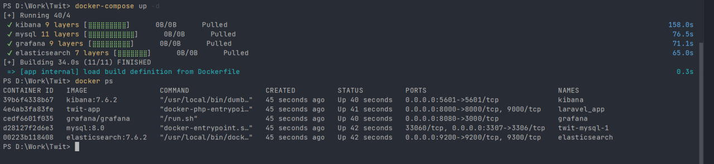

после запуска команды docker ps, теперь мы видим, что все контейнеры запущены

### 2. Скриншот контейнеров на панели управления docker
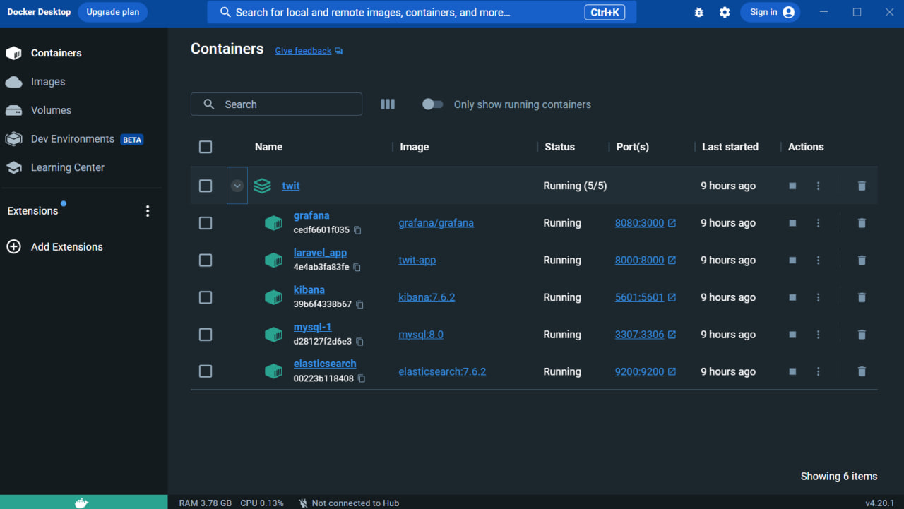


### 3. Скриншот изображений на панели управления docker
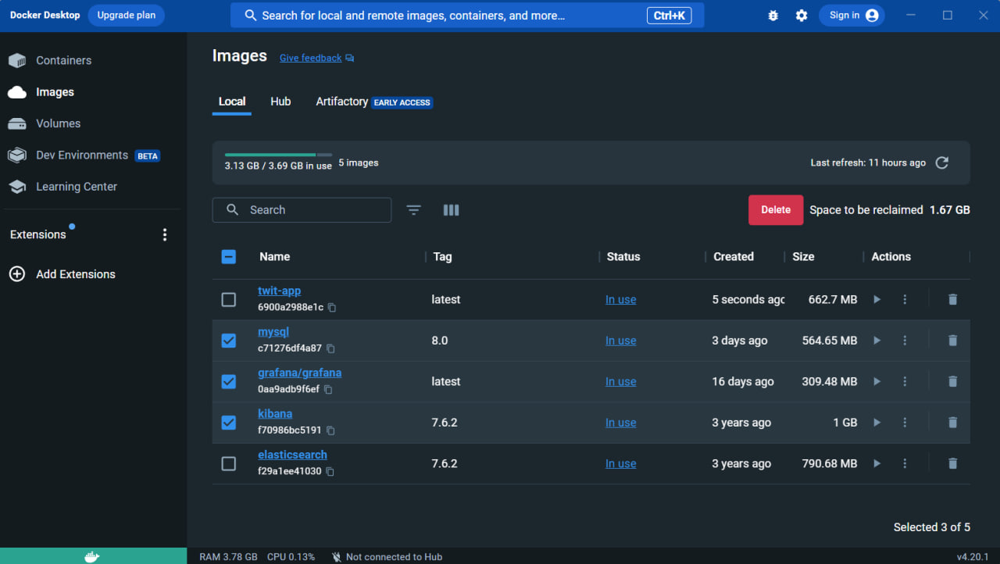


### 4. Скриншот страницы входа в систему
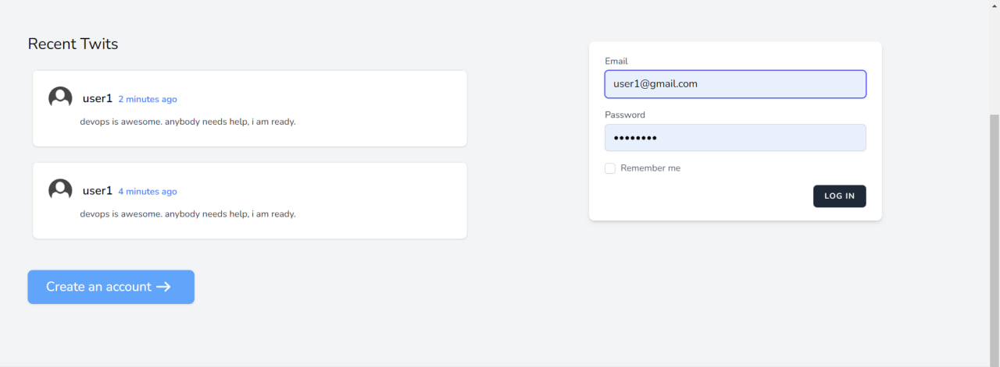


### 5. Скриншот страницы регистрации
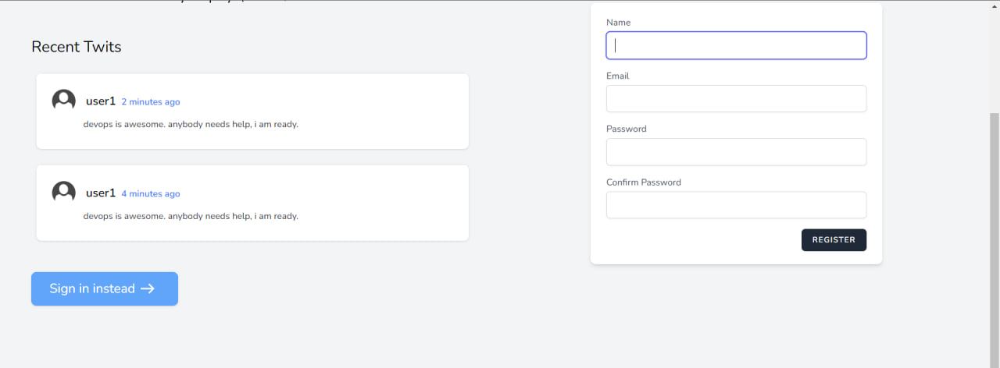


### 6. скриншот главной страницы с Twig
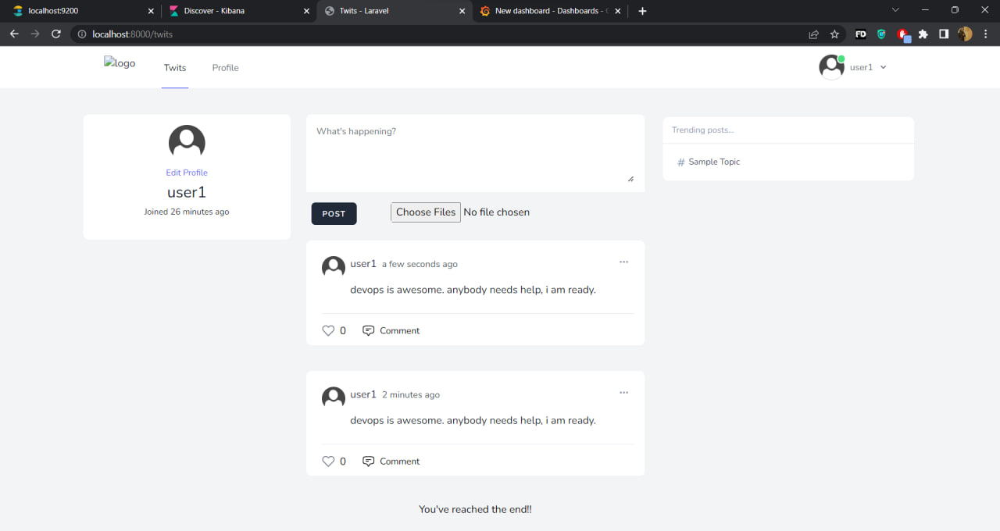


### 7. Скриншот страницы комментариев
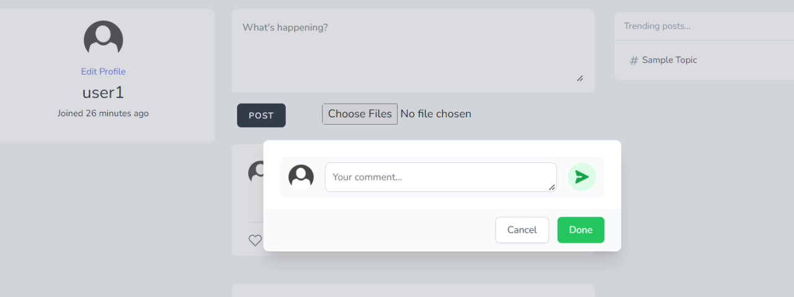

Пользователь может прокомментировать любой пост.


### 8. Скриншот страницы обновления


Пользователь также может обновить Twit (Post)


### 9. Скриншот страницы elasticsearch
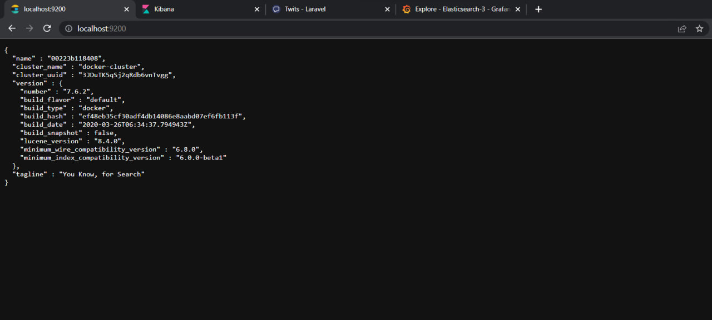

страница elasticsearch возвращает json-файл со всеми данными.


### 10. Скриншот страницы kibana индекса
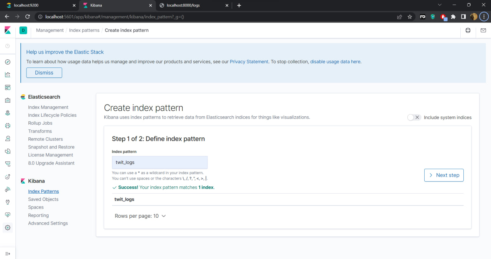

Скриншот страницы kibana для создания индекса (индекс, который я использовал в коде)


### 11. Скриншот страницы kibana индекса
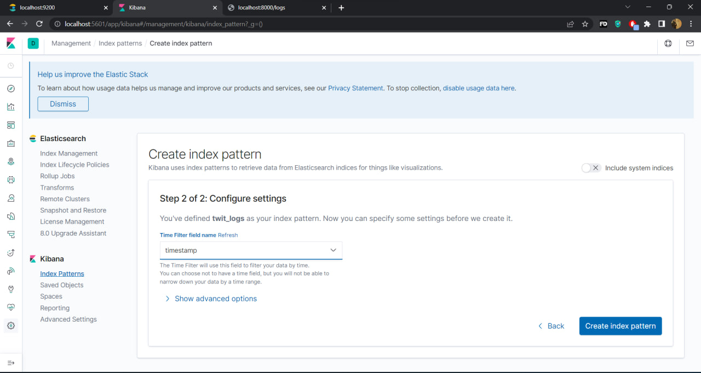


### 12. Скриншот экрана с данными logs kibana
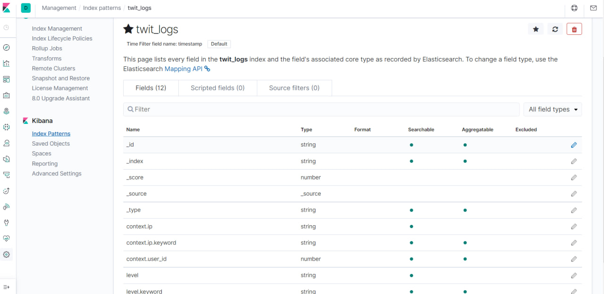

теперь мы видим, что в индексе twit_logs есть данные.


### 13. Скриншот logs kibana
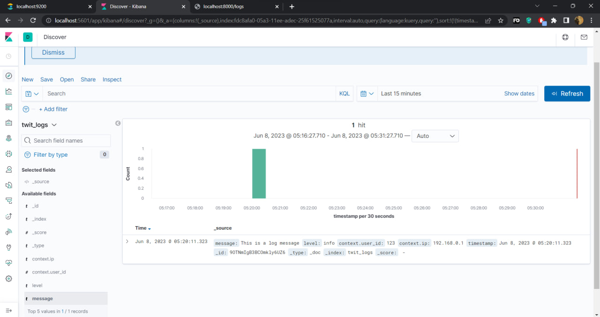

Мы видим, что в индексе twit_logs есть logs, полученные из elasticsearch , и они получены из проекта laravel.


### 14. тоже Скриншот logs kibana


Теперь мы видим, что есть несколько logs с разными сообщениями ,
например, что есть пользователь, который был зарегистрирован, и есть twit, который был добавлен пользователем.


### 15. тоже Скриншот logs kibana
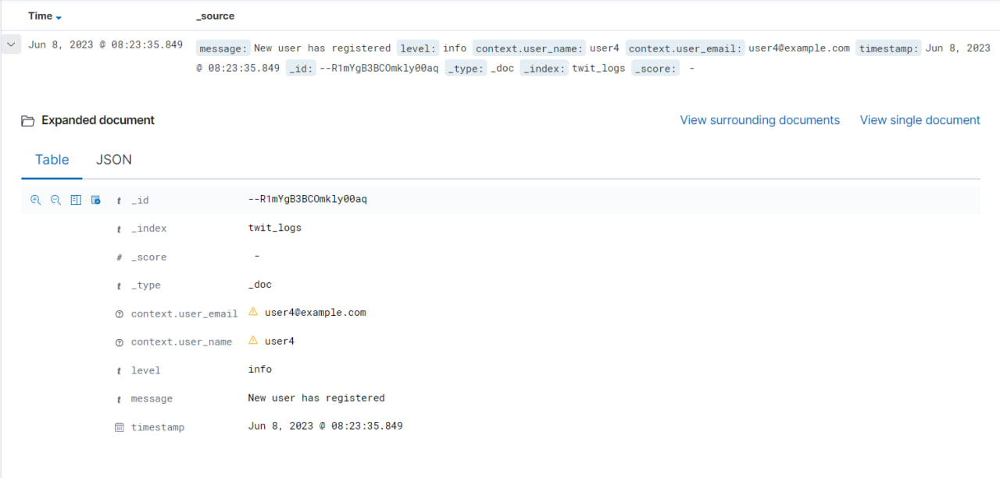


### 16. скриншот данных json из одного log
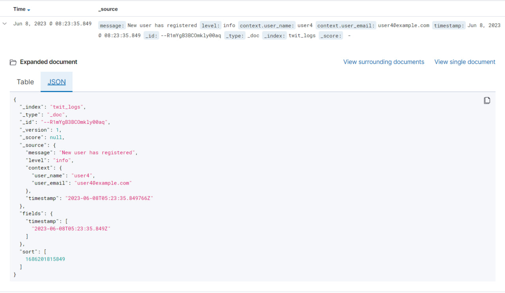

мы видим, что в Json есть данные log.

### 17. скриншот статуса журналов kibana и статуса индекса twit_logs
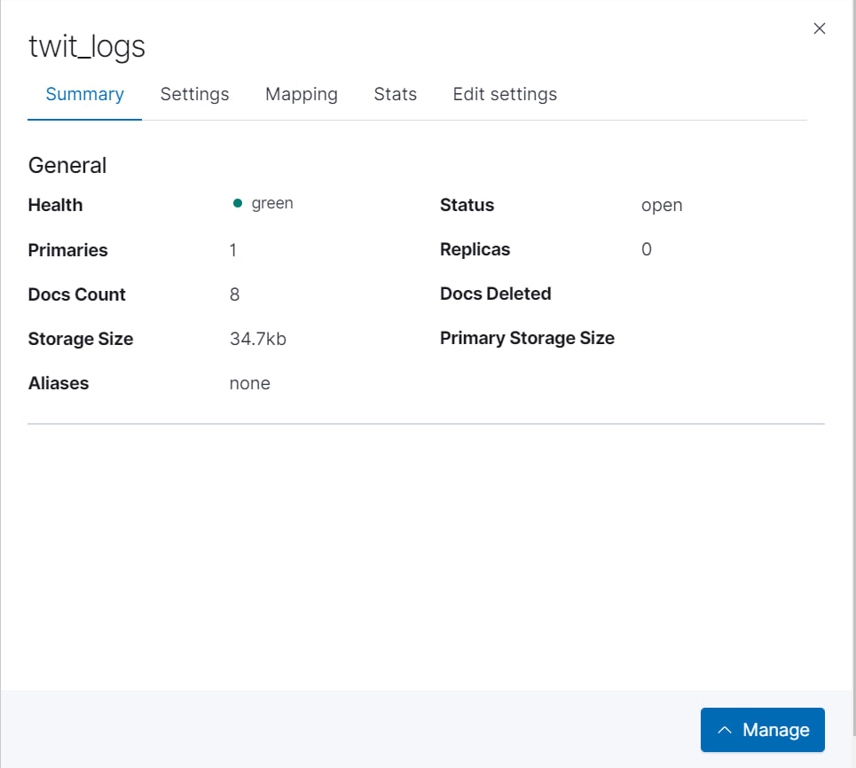

мы можем видеть статус индекса twit_logs, размер хранилища и количество документов


### 18. Скриншот страницы grafan
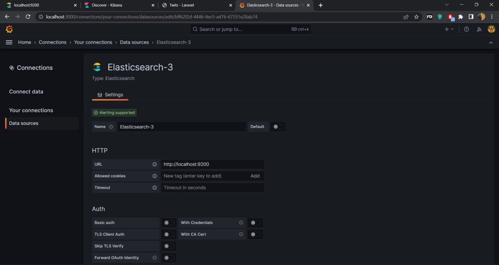

на этом скриншоте мы видим, что есть страница, которую необходимо заполнить данными elasticsearch, 
такими как название индекса, URL-адрес elasticsearch.


### 19. Скриншот страницы grafan
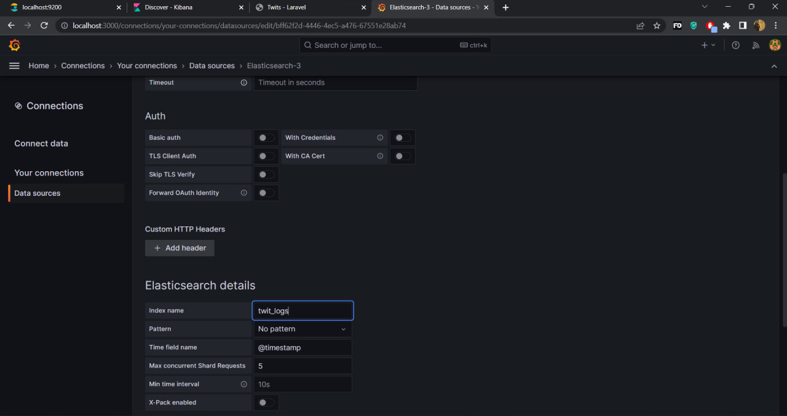

здесь мы ввели название нашего индекса - twit_logs


### 20. Скриншот страницы grafan
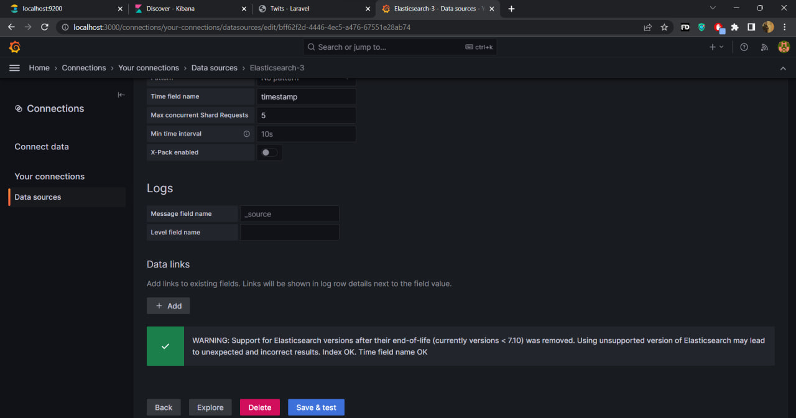

Здесь мы должны нажать кнопку Сохранить и протестировать.


### 21. Скриншот панели мониторинга grafana
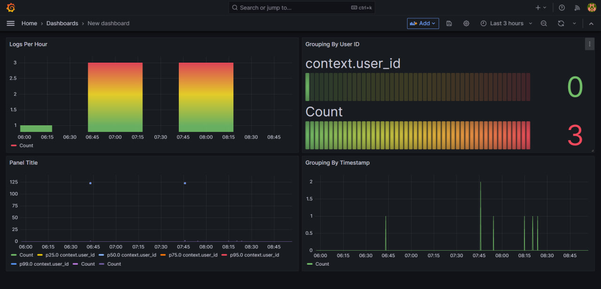

Скриншот панели мониторинга grafana с журналами, полученными из elasticsearch.


### 22. Скриншот панели мониторинга grafana
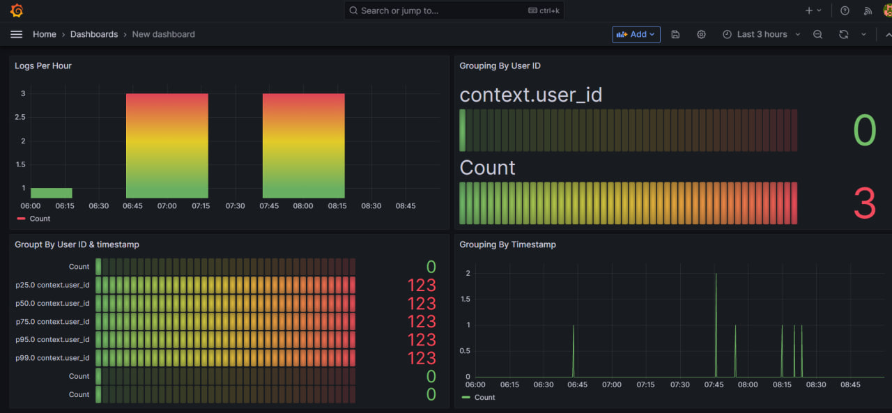

Скриншот панели мониторинга grafana с журналами, полученными из elasticsearch.

</details>


<details>
  <summary><h2>заключение</h2></summary>

Я использовал laravel с Inertia и Reactjs для создания веб-приложений Posts (Twits). 
пользователь может зарегистрироваться в веб-приложении и перейти на домашнюю страницу, 
где он увидит свои Posts, а также Posts других пользователей. он может сделать Post 
(Twit) с сообщением и с image также, если ему нужно.  Пользователь может комментировать
сообщения других пользователей, а также отвечать на любой комментарий. а также он может нажать на
значок сердечка, если ему понравился Post.  Я внедрил регистрацию в коде. итак, когда пользователь 
зарегистрирован, пользователь сделал Post, пользователь прокомментировал Post или пользователь
обновил свою Post. и и я использовал elasticsearch. Я отправил Logs в elasticsearch, используя 
индекс с именем twit_logs. и elasticsearch успешно получил Logs . и я также использовал kibana, чтобы
просмотреть логи, которые расположены в elasticsearch, с хорошим обзором. и затем я использовал Grafana 
для просмотра логи elasticsearch.
</details>


